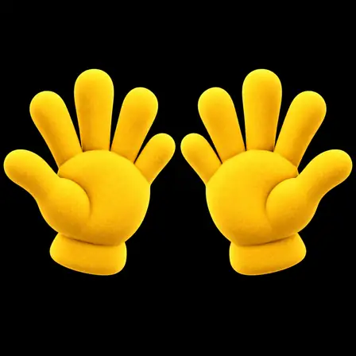

# BOOP Shield: 2.5D puppetry and five-digit hands

Saved from Ryan's design discussion on 2026-09-07. Status: promising visual direction accepted for future work; not an implemented rig, performance result or physical-device acceptance.

## Decision

Explore deliberately using the Shield's graphics hardware for richer real-time 2.5D animation of the existing headphones BOOP. The goal is expressive, responsive puppetry with believable weight, not merely moving one flattened picture or maximising GPU utilisation for its own sake. Keep this inside the canonical `boop-unified` app lineage when implementation is separately requested. `animation-freddie-mercury` remains an art lab, not a second app.

## Non-negotiable hands and character contract

Each hand always has exactly FIVE digits: four fingers plus one thumb. Rig controls must retain separate thumb, index, middle, ring and little fingers throughout every pose and transition. Fingers may bend or be naturally occluded by a grip; they must not be deleted, fused into a permanent four-digit hand, duplicated or changed in count. Check the neutral spread pose and all extreme poses before accepting assets.

The official master in `BOOP_YELLOW_HANDS.md` remains the authority for bright yellow plush material, rounded shapes, palm proportions and short cuffs. Hands float independently without arms. Posing is allowed; redesign is not. Preserve the existing BOOP eyes and headphones. A generated grip illustration is not permission to replace the approved headphones. No extra faces, mouths or animal transformations. The original transparent master stays unchanged; any crops, meshes, layers or previews are labelled derivatives.

## Motion ideas to retain

- Independent wrists and fingers, with open-hand, wave, pointing and curved-grip poses that can eventually animate into one another.
- Hands grip or adjust the earcups. A future interruption gesture could lift one cup, pause in a listening pose and settle it back.
- Eyes lead a glance, the head follows, and headphones/earcups follow with a small controlled delay and recoil. Add blink and squint acting without flattening the entire character.
- Subtle layered depth, parallax and restrained mesh deformation for small turns. More elaborate turns need appropriate new views or a matching model, not invented detail from one flat image.

These are saved performance ideas, not code or a claim that every illustrated pose has passed hand-count/artwork review. Earlier four-digit studies are not approved rig references.

## Engineering direction to investigate later

Start by measuring the actual Shield and the existing renderer. Check whether its Canvas surface is already hardware accelerated; do not assume the present path is CPU-only. Compare an improved layered Canvas approach with a small OpenGL ES renderer when deformation or shader control is needed. Vulkan is not a mandatory choice just because the device can expose it. Keep small pose/state/spring calculations on the CPU where appropriate and use the GPU for drawing/deforming the prepared artwork. No CUDA, rooting, forced clocking or overclocking is required by this proposal.

Target consistently paced 60 fps on a 60 Hz output where the real device can sustain it; respect the actual display cadence and adapt quality/frame rate rather than compete with media playback. Measure frame times, dropped frames, CPU/GPU load where observable, memory, heat and sustained operation with the user's actual media workload. Preserve visibility, screen-off, lifecycle, reduced-motion and power safeguards. No continuous redraw when nothing is changing. Spare capacity has not been measured in this discussion.

Playback-state acting and true beat synchronisation remain separate. The inspected groove is time-driven, not proof of beat detection. Real beat-following needs a separately approved, available timing/audio source. This design introduces no microphone capture, new permissions, audio-focus changes or interception of Deezer's remote input.

## Baseline and evidence boundary

Read-only inspection in this conversation at `104ba193097e9fe229b5853da437aa0ad221d705` found `HeadphoneRenderer.java` drawing one `boop_headphones.png` with translation/rotation, and `FullscreenPuppetMotion.java` producing time-driven groove/settle/track-change poses. This is source evidence, not a measurement of the currently installed Shield build. Fetch the latest live app head before future implementation.

Ryan accepted the hand posing as a good visual start and explicitly repeated the five-digit requirement. Still images establish a visual direction only. No working 2.5D rig, fully jointed hand model, sign-language accuracy, target frame rate or real-device result was demonstrated here.

## Saved artwork and transfer limits

A small `five-digit-open-pose-preview.webp` is archived alongside these notes. It is a 448 x 448 lossy display preview of the corrected open-hand study, not the official master and not a runtime asset. Its black background is baked into the source study; it is not falsely labelled transparent. Preview SHA-256: `d1209ef642d722ff17f1c3d334121d9ac5cfa82ea43f3f50788a1098fdf65192`.

The exact approved master was rechecked from the uploaded ZIP: 1774 x 887 RGBA PNG, 1541931 bytes, SHA-256 `74e3b162d8fa750491b9a1577d51d043e1f7fdcc3940cbdf22f742bc58c9f556`. The corrected open-hand source available as `imagegen.png` is 1254 x 1254 RGB, 1199789 bytes, SHA-256 `7e9f0dea25283626b004f4dbf0c0633544f2310bbe94ce50b0463bc7f6cffdee`.

Those full-resolution PNGs are retained in the downloadable handoff bundle, but are NOT uploaded by this commit. Only one of the new pose-study source images is available as a file in this session. The other grip/pointing/headphone examples remain conversation references and written ideas, not archived PNGs. Do not claim the entire illustrated set is stored in GitHub.

Next safe step: transfer the exact PNGs, verify their checksums and update the transfer manifests. Rigging and app integration require a separate implementation request. This archive changes no app code, live resources, build configuration, version, signing, permissions or deployment, and does not change existing accepted checkpoints.

## Archived display preview

Preview/source provenance: [pose-study manifest](../../unified/assets/boop-yellow-hands/pose-studies/manifest.json).
